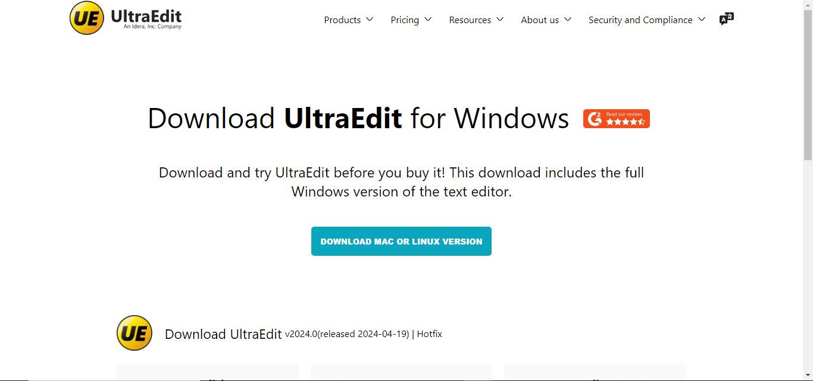
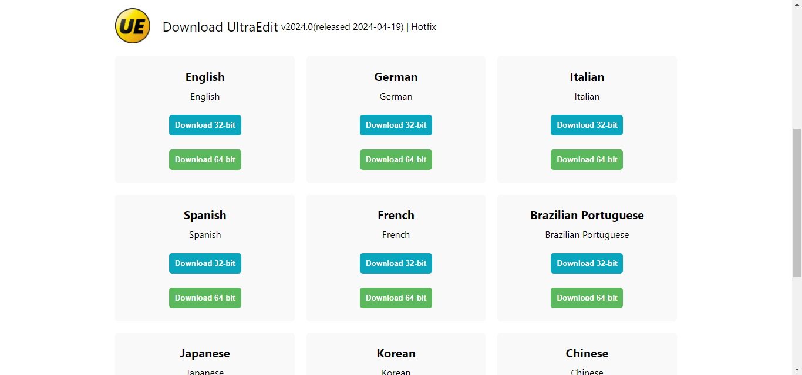
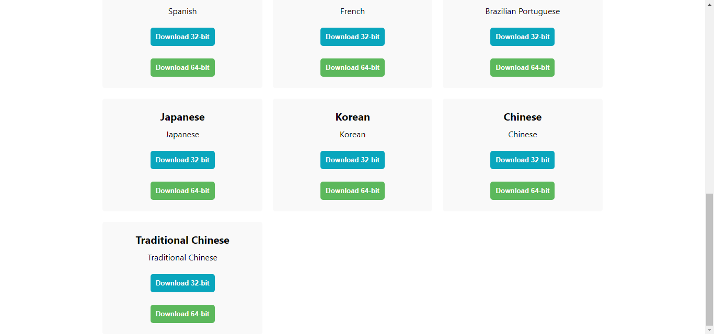

# UltraEdit Landing Page Clone

## Description
This project is a clone of the landing page for **UltraEdit**, a powerful text editor used by developers and professionals for editing code, text, and data files. UltraEdit offers advanced features such as syntax highlighting, customizable toolbars, and file comparison, making it an ideal choice for anyone working with text-based content. 

This clone was created by [@smonishkumar](https://github.com/smonishkumar) as a practice project for HTML and CSS, focusing on replicating the design and layout of the official landing page using only these technologies.

## Screenshots
Here are some screenshots of the landing page:

